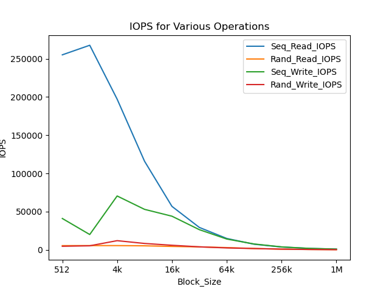
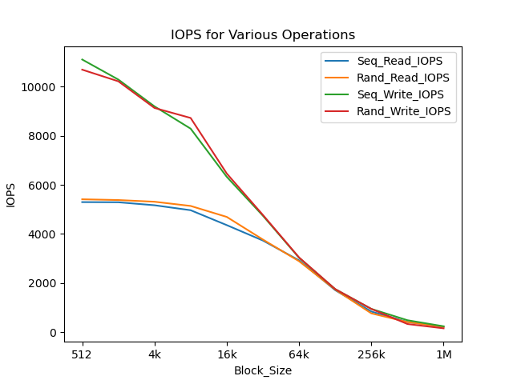
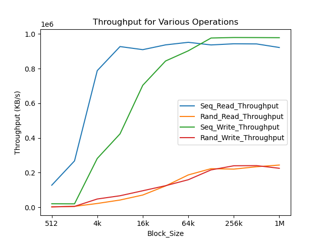
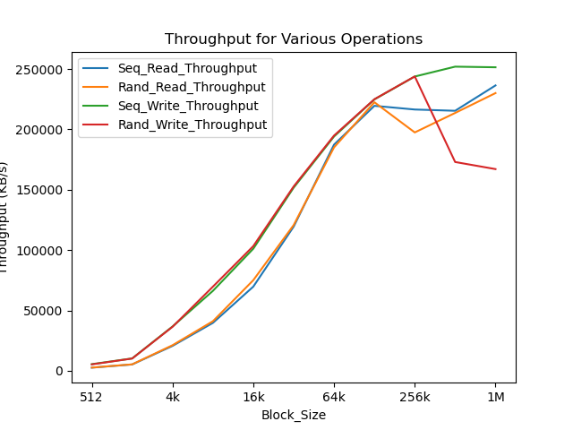

# ZNS-SSD-Project

# SSD Benchmarking Documentation

## Introduction

This document outlines the process and methodologies used for benchmarking Solid State Drives (SSD) to evaluate their performance. Benchmarking an SSD provides insights into its speed, efficiency, and suitability for specific applications or workloads.

## Prerequisites

- **SSD Preparation**: Ensure the SSD is properly connected to the system and recognized by the operating system.
- **Benchmarking Tool**: We will use `fio` (Flexible I/O Tester), a versatile tool for measuring and analyzing I/O performance.
- **System State**: Close unnecessary applications and services that might affect the benchmarking results.

## Benchmarking Process

### Step 1: Installation of `fio`

```sh
# On Ubuntu
sudo apt-get update
sudo apt-get install fio
```

### Step 2: Understanding fio Parameters

We will use several fio options to perform our benchmarks. Here are some of the parameters and their descriptions:

- `filename`: The file or block device to test.
- `rw`: The type of I/O operation, e.g., read, write, randread, randwrite.
- `bs`: Block size used for I/O operations.
- `size`: Total size of I/O for each thread.
- `numjobs`: Number of threads or processes to simulate.
- `ioengine`: I/O engine to use (sync, psync, libaio, or io_uring).
- `direct`: Use direct I/O (1) or buffered I/O (0).

### Step 3: Running Benchmarks

Here's an example fio command:

```sh
fio --name=benchmark --size=1G --filename=/dev/nvme0n1 --bs=4k --rw=randread --ioengine=libaio --iodepth=32 --direct=1
```

### Step 4: Analyzing Results

    Results will provide various metrics, including IOPS, latency, and throughput.
    Direct I/O vs. Buffered I/O

        direct=0: Uses the OS buffer cache, which can lead to faster performance due to caching but does not always represent true hardware performance.
        direct=1: Bypasses the OS cache, directly interacting with the device, providing a more accurate representation of the SSD's raw performance.

    I/O Engines

        libaio: Provides asynchronous I/O operations for Linux, using kernel AIO.
        io_uring: A newer, efficient, and feature-rich asynchronous I/O API for Linux.
        psync: Synchronous I/O, where each I/O operation must complete before the next begins.

### Results and Figures

    To illustrate the differences in performance, the following figures compare the IOPS and throughput between direct=0 and direct=1:




Figure 1: IOPS Comparison between direct=0 and direct=1




Figure 2: Throughput Comparison between direct=0 and direct=1

### Conclusion

    Benchmarking SSDs is a critical process for assessing performance characteristics under various conditions. Using different fio options and understanding their implications helps in conducting effective and targeted benchmarks.
